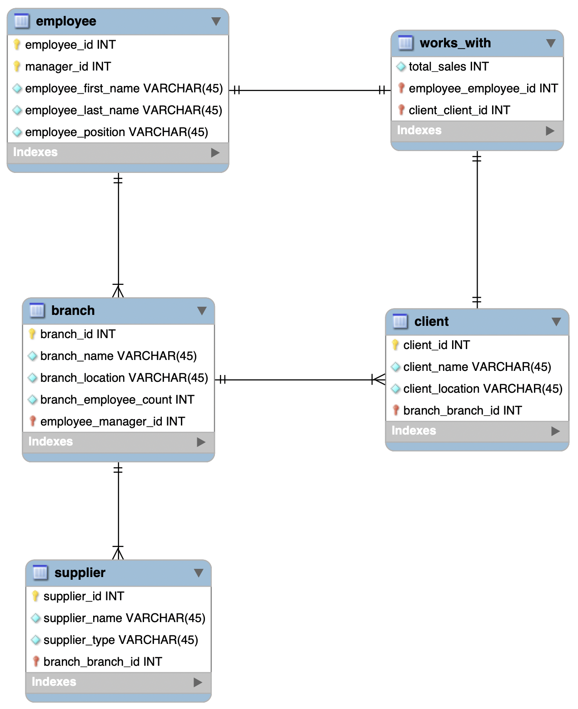

# Company Management System Database

This project is a **Company Management System Database** designed to simulate the operations of a business with multiple branches, employees, clients, and suppliers. Using **SQLite**, the project focuses on implementing key database management practices such as creating normalized tables, managing relationships between entities, enforcing data integrity through constraints, and optimizing queries for performance.

Key features of the system include:
- **Employee management**, with tracking of employee roles, managers, and branch assignments.
- **Branch information**, including the number of employees and the location of each branch.
- **Client tracking**, linking clients to specific branches for sales and services.
- **Supplier relationships**, capturing supplier information tied to branch locations.
- **Works_with table**, recording the total sales generated by employees for each client.

## Database Diagram

Advanced SQL features such as **triggers**, **indexing**, and **recursive queries** are employed to enhance the system’s efficiency and data integrity. Triggers automatically update the employee count in each branch when employees are added or removed, and indexing improves query performance by creating a quick lookup for frequent searches.

The project provides several practical queries, such as:
- Calculating total sales per branch.
- Retrieving employee and client data by branch.
- Managing hierarchical relationships between employees and their managers.

By following best practices and structuring the database to reflect real-world company operations, this project serves as both a learning tool and a foundation for expanding into more complex business applications.
